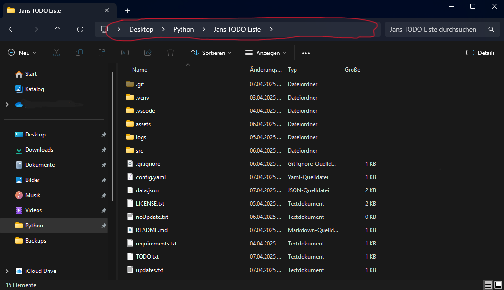

# TODO Liste

Eine simple TODO Liste für Aufgaben, die man abhaken kann. An einem bestimmten Wochentag werden die Aufgaben zurückgesetzt (Standard: Freitag 20 Uhr). 

## Installation

Es ist nicht üblich aus Python eine .exe Datei zu machen. Weswegen ich auch zumindest erstmal keine mache. Vielleicht mache ich noch ein Skript, das das Ganze hier automatisch installiert, bis dahin muss man es leider manuell machen:

1. [Python installieren](https://www.python.org/downloads/)
    
    "Add Python 3.xx to PATH" **muss** angekreuzt werden

2. GitHub Repository (also das alles hier) [herunterladen](https://github.com/JustAName3/Jans-TODO-Liste/archive/refs/heads/master.zip) und entpacken.  

3. In den Ordner "Jans TODO Liste" wechseln (im entpackten Ordner) und auf die Leiste oben im Explorer klicken (rot markiert), "cmd" eingeben und Enter drücken. 

4. Ein Konsolenfenster sollte sich geöffnet haben. Darin folgenden Befehl einfügen und enter drücken:
    
        pip install -r requirements.txt

    Dieser Befehl installiert alle dependencies (Code der nicht mit Python mitgeliefert wird).

5.  Den Ordner mit dem Code kann man jetzt wo man will platzieren, bis auf Ordner für die man Admin Rechte braucht. Ich empfehle einfach auf C:.

6. Verknüpfung

    Um eine Verknüpfung zu machen einfach Rechtsklick (z.B. auf den Desktop) -> neu -> Verknüpfung.
    In das Feld "pythonw", Leerzeichen und danach den Pfad zur main.py Datei eingeben. Die main.py Datei ist im Ordner "src" (der im entpackten Ordner ist). Um den Pfad zu kopieren Shift + Rechtsklick auf die main.py Datei und auf "Als Pfad kopieren" drücken. 
    
    Beispiel:

        pythonw "C:\Jans TODO Liste\src\main.py"

    Die Verknüpfung kann man wie man will benennen und auch verschieben.

7. Icon ändern (optional)
    
    Um das Icon der Verknüpfung zu ändern Rechtsklick auf die Verknüpfung -> Eigenschaften. Unten auf "Anderes Symbol" -> Durchsuchen. Hier den Ordner der App -> "assets" öffnen und "done.ico" auswählen und auf "ok" und "übernehmen" klicken.

## Benutzung

In der App wird sich noch ein wenig ändern. Dieser Teil kommt erst später

___

Bugs und Wünsche am besten direkt bei diesem GitHub Repository als [issue](https://github.com/JustAName3/Jans-TODO-Liste/issues) einreichen. 